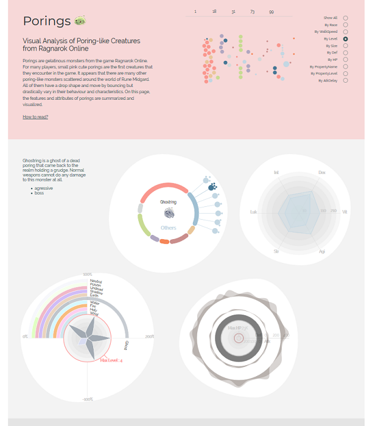

# Explore Poring Family

Porings are kinds of monsters from Ragnarok Online, the online game I used to play as a kid. 
This projects was implemented with a view to learning the d3.js framework.

The data has been scraped from the database (available on http://ratemyserver.net/) and preprocessed with python.

The descriptions of porings are from [ratemyserver.net](http://ratemyserver.net/), [iRO wiki](http://db.irowiki.org), [Ragnarök Wiki](https://ragnarok.gamepedia.com/Ragnarok_Wiki), [ROGuard](https://www.roguard.net/) Ragnarok Databases and [The Ragnarok Monster Lore](https://forums.warpportal.com/index.php?/topic/106898-encyclopaedia-ragnarok-monster-lore-mitten/), a fan made encyclopedia.

The results are available on https://kor-al.github.io/porings/. 
Some intermediate results on Observable: https://beta.observablehq.com/@kor-al/poring-family. 

The article on Medium: https://medium.com/@korinalice/porings-4345b46aaa64

